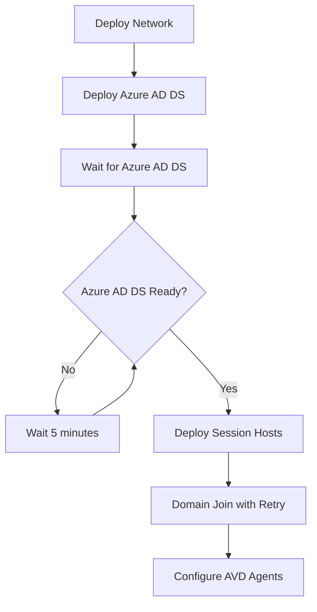

# Azure AD Domain Services Timing Fix

This document explains the fix for the domain join failure issue that occurs when Azure Entra ID Domain Services (Azure AD DS) is not fully operational before session hosts attempt to join the domain.

## Problem

Azure AD Domain Services takes a significant amount of time to deploy and become operational (typically 60-90 minutes). The original deployment template would deploy session hosts immediately after creating the Azure AD DS resource, causing domain join operations to fail because the domain controllers were not yet available.

## Solution

The solution implements a **wait mechanism** using Azure Deployment Scripts to ensure Azure AD DS is fully operational before attempting to join session hosts to the domain.

### Key Components

1. **Wait for Azure AD DS Module** (`wait-for-aadds.bicep`)
   - Creates a managed identity with Reader permissions
   - Deploys a PowerShell-based deployment script
   - Monitors Azure AD DS provisioning state and operational readiness
   - Verifies DNS resolution for the domain
   - Waits up to 3 hours for Azure AD DS to become ready

2. **Enhanced Session Hosts Module**
   - Adds dependency on the wait script
   - Includes retry logic for domain join operations
   - Improved error handling and verification

3. **Improved Configuration Script**
   - Verifies domain join status before proceeding
   - Better error handling and logging
   - Waits for domain join completion if in progress

### Deployment Flow

### Benefits

- **Eliminates domain join failures** due to timing issues
- **Automatic retry logic** for transient domain join issues
- **Better monitoring** of Azure AD DS deployment progress
- **Improved error handling** and logging
- **More reliable deployments** with clear status information

## Files Modified

- `infra/main.bicep` - Added wait script module and dependency
- `infra/modules/session-hosts.bicep` - Enhanced domain join with retry logic
- `scripts/sessionhost/ConfigureSessionHost.ps1` - Added domain join verification
- `infra/modules/wait-for-aadds.bicep` - New wait script module

## Configuration Parameters

The wait script includes the following configurable parameters:

- **Maximum wait time**: 3 hours (180 minutes)
- **Check interval**: 5 minutes
- **Domain join retries**: 4 attempts
- **Retry interval**: 5 minutes between attempts

## Monitoring

The deployment script provides detailed logging and status information:

- Azure AD DS provisioning state monitoring
- Domain controller availability checks
- DNS resolution verification
- Deployment timestamps and status

## Outputs

Additional outputs are now available to monitor the deployment:

- `aaddsReadyStatus` - Status of Azure AD DS readiness
- `aaddsReadyTime` - Timestamp when Azure AD DS became ready

## Best Practices

1. **Monitor deployment progress** through Azure portal or CLI
2. **Check deployment script logs** if issues occur
3. **Verify DNS settings** in your environment
4. **Ensure proper permissions** for the managed identity

## Troubleshooting

If deployment still fails:

1. Check Azure AD DS deployment logs in the Azure portal
2. Verify network connectivity between session hosts and domain controllers
3. Ensure proper DNS resolution for the domain name
4. Check the deployment script execution logs
5. Verify Azure AD DS is in "Running" state with available domain controllers

## Implementation Notes

- The solution uses Azure Resource Manager deployment scripts
- Requires Azure PowerShell module version 11.0 or higher
- Creates a temporary managed identity for monitoring Azure AD DS
- Automatically cleans up resources after successful completion
- Compatible with existing Azure Virtual Desktop deployments